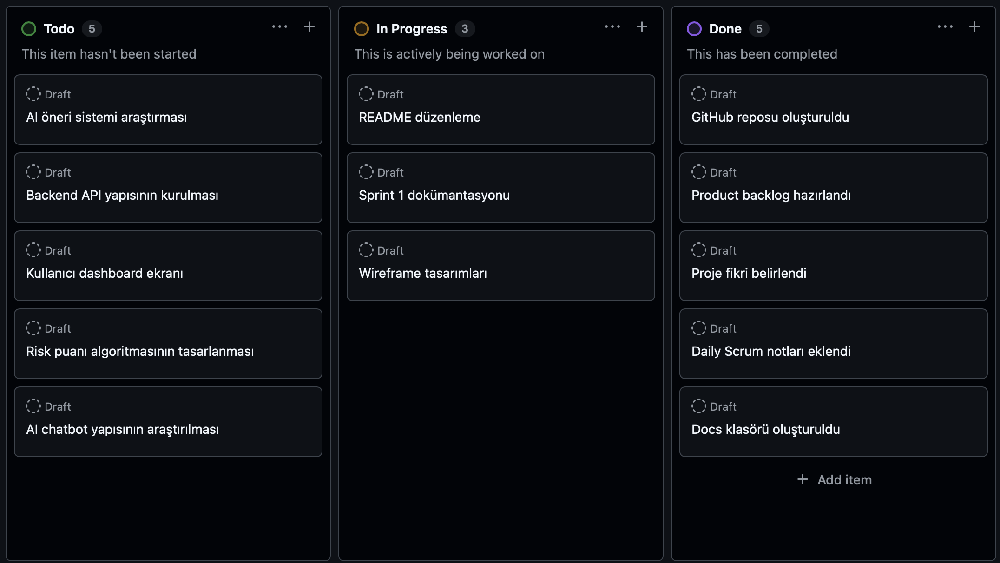
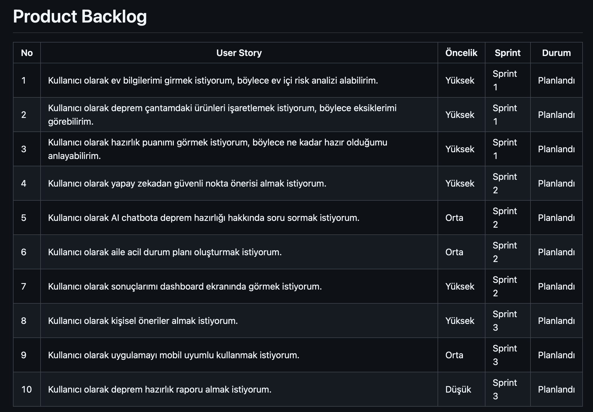
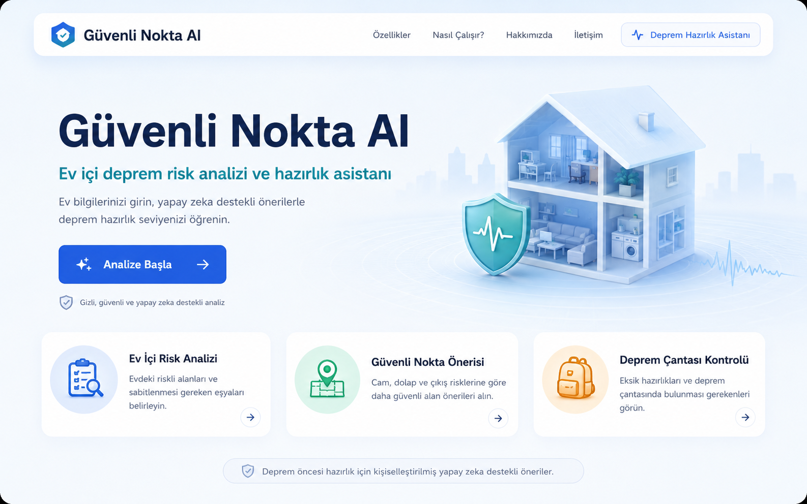
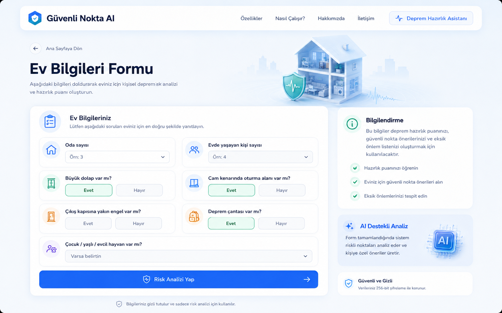
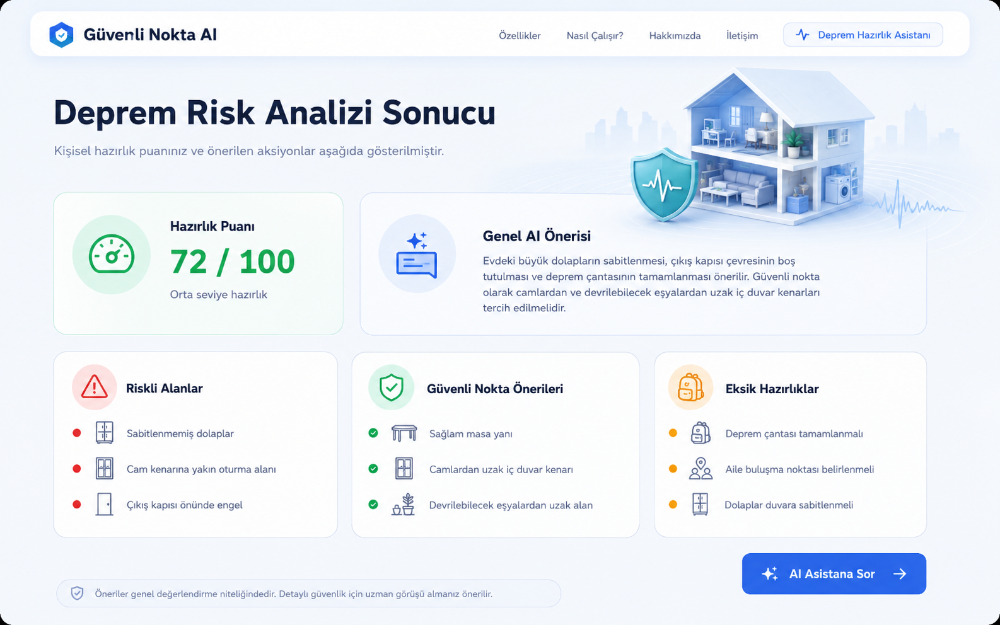

# Güvenli Nokta AI

Güvenli Nokta AI, kullanıcıların ev içi deprem risklerini analiz etmelerine ve deprem öncesi hazırlık seviyelerini artırmalarına yardımcı olan yapay zeka destekli bir hazırlık asistanıdır.

---

## Takım Bilgileri

### Takım İsmi

Takım ismi henüz belirlenecek.

### Takım Üyeleri ve Rolleri

| İsim                 | Rol           |
| -------------------- | ------------- |
| Ahmet Çağdaş Geçgül  | Scrum Master  |
| Atagün Körükmez      | Product Owner |
| Ömer Faruk Yurtdakal | Developer     |
| Nesibe Şeyma Can     | Developer     |
| Berat Karagöl        | Developer     |

---

## Ürün Bilgileri

### Ürün İsmi

**Güvenli Nokta AI**

### Ürün Açıklaması

Güvenli Nokta AI, kullanıcıdan alınan ev ve aile bilgilerine göre ev içi deprem risklerini analiz eden, güvenli nokta önerileri sunan ve kişisel deprem hazırlık puanı oluşturan yapay zeka destekli bir web uygulamasıdır.

### Problem

Deprem riski yüksek bölgelerde yaşayan birçok kişi, ev içerisindeki riskli alanları, sabitlenmesi gereken eşyaları ve deprem öncesi hazırlık seviyesini tam olarak bilmemektedir.

### Çözüm

Sistem; kullanıcıdan aldığı bilgilere göre riskli alanları belirler, güvenli nokta önerileri sunar, deprem çantası eksiklerini analiz eder ve kullanıcıya kişiselleştirilmiş hazırlık önerileri verir.

### Hedef Kitle

* Evinde deprem hazırlığı yapmak isteyen bireyler
* Aileler
* Öğrenciler
* Yaşlı, çocuk veya evcil hayvan bulunan haneler
* Deprem riski yüksek bölgelerde yaşayan kullanıcılar

---

## Ürün Özellikleri

* Ev içi deprem risk analizi
* Güvenli nokta önerisi
* Deprem çantası eksik analizi
* Hazırlık puanı hesaplama
* AI destekli kişisel öneri sistemi
* Kullanıcı paneli
* Deprem hazırlık chatbotu
* Aile acil durum planı önerisi

---

## Kullanılacak Teknolojiler

| Alan           | Teknoloji                      |
| -------------- | ------------------------------ |
| Frontend       | React                          |
| Backend        | Node.js / Express veya FastAPI |
| Yapay Zeka     | Gemini API veya benzer LLM API |
| Veritabanı     | Firebase / MongoDB             |
| Proje Yönetimi | GitHub Projects                |
| Dokümantasyon  | Markdown                       |

---

## Product Backlog

Product backlog dosyası:
[docs/product-backlog.md](docs/product-backlog.md)

---

## Sprint 1 Dokümantasyonu

Sprint 1 kapsamında proje fikri netleştirilmiş, takım rolleri belirlenmiş, product backlog hazırlanmış, sprint board oluşturulmuş ve ilk arayüz taslakları çıkarılmıştır.

| Başlık                  | Dosya                                                                                |
| ----------------------- | ------------------------------------------------------------------------------------ |
| Sprint 1 Genel Özeti    | [docs/sprint-1/README.md](docs/sprint-1/README.md)                                   |
| Backlog Dağıtma Mantığı | [docs/sprint-1/backlog-dagitim-mantigi.md](docs/sprint-1/backlog-dagitim-mantigi.md) |
| Daily Scrum Notları     | [docs/sprint-1/daily-scrum-notlari.md](docs/sprint-1/daily-scrum-notlari.md)         |
| Sprint Board Updates    | [docs/sprint-1/sprint-board-updates.md](docs/sprint-1/sprint-board-updates.md)       |
| Ürün Durumu             | [docs/sprint-1/urun-durumu.md](docs/sprint-1/urun-durumu.md)                         |
| Sprint Review           | [docs/sprint-1/sprint-review.md](docs/sprint-1/sprint-review.md)                     |
| Sprint Retrospective    | [docs/sprint-1/sprint-retrospective.md](docs/sprint-1/sprint-retrospective.md)       |

---

## Sprint 1 Ekran Görüntüleri

### Sprint Board



### Product Backlog



### Ana Sayfa Taslağı



### Ev Bilgileri Formu Taslağı



### Risk Analizi Sonuç Ekranı Taslağı



---

## Proje Klasör Yapısı

```text
guvenli-nokta-ai/
│
├── README.md
│
├── docs/
│   ├── product-backlog.md
│   └── sprint-1/
│       ├── README.md
│       ├── backlog-dagitim-mantigi.md
│       ├── daily-scrum-notlari.md
│       ├── sprint-board-updates.md
│       ├── urun-durumu.md
│       ├── sprint-review.md
│       └── sprint-retrospective.md
│
├── assets/
│   └── screenshots/
│       ├── sprint-board.png
│       ├── product-backlog.png
│       ├── wireframe-home.png
│       ├── wireframe-form.png
│       └── wireframe-result.png
│
├── frontend/
├── backend/
└── ai/
```

---

## Sprint 2 İçin Planlananlar

* Frontend arayüzlerinin React ile geliştirilmeye başlanması
* Ev bilgileri formunun kodlanması
* Backend API yapısının kurulması
* Risk puanı algoritmasının tasarlanması
* AI öneri sistemi için ilk prototipin hazırlanması
* Kullanıcı verilerinin veritabanına kaydedilmesi
* Dashboard ekranının geliştirilmesi

---

