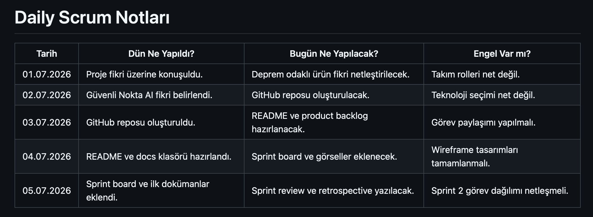

# Güvenli Nokta AI

Güvenli Nokta AI, kullanıcıların ev içi deprem risklerini analiz etmelerine ve deprem öncesi hazırlık seviyelerini artırmalarına yardımcı olan yapay zeka destekli bir hazırlık asistanıdır.

---

## Takım İsmi

QuakeGuard Team
---

## Takım Üyeleri ve Rolleri

| İsim                 | Rol           |
| -------------------- | ------------- |
| Ahmet Çağdaş Geçgül  | Scrum Master  |
| Atagün Körükmez      | Product Owner |
| Ömer Faruk Yurtdakal | Developer     |
| Nesibe Şeyma Can     | Developer     |
| Berat Karagöl        | Developer     |

---

## Ürün İsmi

**Güvenli Nokta AI**

---

## Ürün Açıklaması

Güvenli Nokta AI, kullanıcıdan alınan ev ve aile bilgilerine göre ev içi deprem risklerini analiz eden, güvenli nokta önerileri sunan ve kişisel deprem hazırlık puanı oluşturan yapay zeka destekli bir web uygulamasıdır.

Kullanıcı; oda sayısı, büyük eşyalar, cam kenarları, çıkış noktaları, aile yapısı ve deprem çantası durumu gibi bilgileri sisteme girer. Sistem bu bilgilere göre riskli alanları belirler, daha güvenli noktalar önerir, alınması gereken önlemleri listeler ve kullanıcıya kişisel bir deprem hazırlık puanı sunar.

---

## Problem

Deprem riski yüksek bölgelerde yaşayan birçok kişi, ev içerisindeki riskli alanları, sabitlenmesi gereken eşyaları ve deprem öncesi hazırlık seviyesini tam olarak bilmemektedir.

Ayrıca deprem çantası, aile buluşma noktası, acil durum planı ve ev içi güvenli alan seçimi gibi konular çoğu zaman eksik kalmaktadır. Bu durum deprem anında can güvenliği açısından ciddi riskler oluşturabilir.

---

## Çözüm

Güvenli Nokta AI, kullanıcının verdiği bilgilere göre kişiselleştirilmiş deprem hazırlık analizi yapar.

Sistem kullanıcıya:

* Ev içi risk analizi
* Güvenli nokta önerileri
* Deprem çantası eksik analizi
* Hazırlık puanı
* AI destekli kişisel öneriler
* Aile acil durum planı önerileri

sunmayı hedefler.

---

## Hedef Kitle

* Evinde deprem hazırlığı yapmak isteyen bireyler
* Aileler
* Öğrenciler
* Yaşlı, çocuk veya evcil hayvan bulunan haneler
* Deprem riski yüksek bölgelerde yaşayan kullanıcılar
* Deprem bilincini artırmak isteyen kişiler

---

## Ürün Özellikleri

* Ev içi deprem risk analizi
* Güvenli nokta önerisi
* Deprem çantası eksik analizi
* Hazırlık puanı hesaplama
* AI destekli kişisel öneri sistemi
* Kullanıcı paneli
* Deprem hazırlık chatbotu
* Aile acil durum planı önerisi

---

## Kullanılacak Teknolojiler

| Alan           | Teknoloji                      |
| -------------- | ------------------------------ |
| Frontend       | React                          |
| Backend        | Node.js / Express veya FastAPI |
| Yapay Zeka     | Gemini API veya benzer LLM API |
| Veritabanı     | Firebase / MongoDB             |
| Proje Yönetimi | GitHub Projects                |
| Dokümantasyon  | Markdown                       |

---

## Product Backlog

Product backlog dosyası:
[docs/product-backlog.md](docs/product-backlog.md)

### Product Backlog Görseli


---

# Sprint 1

## Sprint Notları

Sprint 1 sürecinde projenin temel fikri netleştirilmiş, takım üyeleri ve rolleri belirlenmiş, product backlog hazırlanmış, GitHub Projects üzerinde sprint board oluşturulmuş ve ürünün ilk arayüz taslakları çıkarılmıştır.

Bu sprintte temel amaç, doğrudan kod geliştirmeye başlamadan önce ürün fikrini, hedef kitleyi, proje yönetimi yapısını ve ilk kullanıcı akışını belirlemek olmuştur.

---

## Sprint İçinde Tamamlanması Hedeflenen Puan

Sprint 1 için hedeflenen toplam iş yükü **100 puan** olarak belirlenmiştir.

## Puan Tamamlama Mantığı

Sprint 1 puanlaması; proje fikrinin netleştirilmesi, takım rollerinin belirlenmesi, product backlog hazırlanması, sprint board oluşturulması, daily scrum notlarının tutulması, README düzenlemesi ve ilk arayüz taslaklarının hazırlanması üzerinden yapılmıştır.

| Görev | Puan |
|---|---:|
| Proje fikrinin netleştirilmesi | 15 |
| Takım rolleri ve ürün bilgilerinin belirlenmesi | 10 |
| Product backlog oluşturulması | 15 |
| Sprint board hazırlanması | 15 |
| Daily Scrum notlarının hazırlanması | 10 |
| README formatının düzenlenmesi | 15 |
| İlk arayüz taslaklarının hazırlanması | 20 |
| **Toplam** | **100** |

## Backlog Dağıtma Mantığı

Sprint 1 sürecinde öncelik, ürünün teknik geliştirmesinden önce proje fikrini ve proje yönetimi yapısını netleştirmek olarak belirlenmiştir.

Bu nedenle ilk sprintte şu işler önceliklendirilmiştir:

* GitHub repository oluşturma
* README dosyasını düzenleme
* Product backlog oluşturma
* Sprint board oluşturma
* Daily Scrum notları hazırlama
* İlk arayüz taslaklarını çıkarma
* Risk analizi mantığını planlama

Kod geliştirme, backend API kurulumu, AI entegrasyonu ve dashboard geliştirmesi gibi teknik işler Sprint 2’ye bırakılmıştır.

---

## Daily Scrum

Daily Scrum notları takımın ilerleyişini takip etmek için hazırlanmıştır.

| Tarih      | Dün Ne Yapıldı?                         | Bugün Ne Yapılacak?                       | Engel Var mı?                       |
| ---------- | --------------------------------------- | ----------------------------------------- | ----------------------------------- |
| 01.07.2026 | Proje fikri üzerine konuşuldu.          | Deprem odaklı ürün fikri netleştirilecek. | Takım rolleri net değil.            |
| 02.07.2026 | Güvenli Nokta AI fikri belirlendi.      | GitHub reposu oluşturulacak.              | Teknoloji seçimi net değil.         |
| 03.07.2026 | GitHub reposu oluşturuldu.              | README ve product backlog hazırlanacak.   | Görev paylaşımı yapılmalı.          |
| 04.07.2026 | README ve docs yapısı hazırlandı.       | Sprint board ve görseller eklenecek.      | Wireframe tasarımları tamamlanmalı. |
| 05.07.2026 | Sprint board ve ilk dokümanlar eklendi. | Sprint review ve retrospective yazılacak. | Sprint 2 görev dağılımı netleşmeli. |

### Daily Scrum Ekran Görüntüsü



---

## Sprint Board Updates

Sprint 1 görevleri GitHub Projects üzerinde **Todo**, **In Progress** ve **Done** sütunlarıyla takip edilmiştir.

### Todo

* AI öneri sistemi araştırması
* Backend API yapısının kurulması
* Kullanıcı dashboard ekranı
* Risk puanı algoritmasının tasarlanması
* AI chatbot yapısının araştırılması

### In Progress

* README düzenleme
* Sprint 1 dokümantasyonu
* Wireframe tasarımları

### Done

* GitHub reposu oluşturuldu
* Product backlog hazırlandı
* Proje fikri belirlendi
* Daily Scrum notları eklendi
* Docs klasörü oluşturuldu

### Sprint Board Görseli


---

## Ürün Durumu

Sprint 1 sonunda ürünün temel fikri, hedef kitlesi, problem tanımı, çözüm yaklaşımı ve temel özellikleri belirlenmiştir.

Kod geliştirme aşamasına geçmeden önce ürünün ilk ekran taslakları hazırlanmıştır. Sprint 2 itibarıyla frontend, backend ve yapay zeka entegrasyonu tarafında geliştirme sürecine başlanması planlanmaktadır.

### Ana Sayfa Taslağı


### Ev Bilgileri Formu Taslağı


### Risk Analizi Sonuç Ekranı Taslağı


---

## Sprint Review

Sprint 1 sonunda aşağıdaki çıktılar tamamlanmıştır:

* GitHub repository oluşturuldu.
* Takım üyeleri ve rolleri belirlendi.
* Ürün fikri **Güvenli Nokta AI** olarak netleştirildi.
* Product backlog oluşturuldu.
* GitHub Projects üzerinde sprint board hazırlandı.
* Daily Scrum notları hazırlandı.
* Ana sayfa, ev bilgileri formu ve risk analizi sonuç ekranı için wireframe tasarımları oluşturuldu.
* README dosyası sprint formatına göre düzenlendi.

Sprint 1 sonunda ürün henüz kod geliştirme aşamasında değildir. Ancak proje geliştirme sürecine başlanabilmesi için gerekli planlama, backlog ve arayüz taslakları hazırlanmıştır.

---

## Sprint Retrospective

### İyi Gidenler

* Proje fikri kısa sürede netleştirildi.
* Takım rolleri belirlendi.
* GitHub repository oluşturuldu.
* Product backlog hazırlandı.
* Sprint board oluşturuldu.
* İlk arayüz taslakları hazırlandı.

### Geliştirilmesi Gerekenler

* Takım içi görev dağılımı daha net yapılmalı.
* Her ekip üyesinin düzenli commit atması sağlanmalı.
* Daily Scrum notları daha düzenli tutulmalı.
* Sprint 2’de geliştirme süreci hızlandırılmalı.

### Sprint 2 İçin Aksiyonlar

* Frontend ekranlarının React ile kodlanmasına başlanacak.
* Backend API yapısı kurulacak.
* Risk puanı algoritması geliştirilecek.
* AI öneri sistemi için ilk prototip hazırlanacak.
* Kullanıcı verilerinin veritabanına kaydedilmesi planlanacak.
* Dashboard ekranı geliştirilecek.

---

## Proje Klasör Yapısı

```text
guvenli-nokta-ai/
│
├── README.md
│
├── docs/
│   └── product-backlog.md
│
├── assets/
│   └── screenshots/
│       ├── product-backlog.png
│       ├── sprint-board.png
│       ├── daily-scrum.png
│       ├── wireframe-home.png
│       ├── wireframe-form.png
│       └── wireframe-result.png
│
├── frontend/
├── backend/
└── ai/
```

---

## Sprint 2 İçin Planlananlar

* Frontend arayüzlerinin React ile geliştirilmeye başlanması
* Ev bilgileri formunun kodlanması
* Backend API yapısının kurulması
* Risk puanı algoritmasının tasarlanması
* AI öneri sistemi için ilk prototipin hazırlanması
* Kullanıcı verilerinin veritabanına kaydedilmesi
* Dashboard ekranının geliştirilmesi
* AI chatbot yapısının araştırılması

---

## Proje Notu

Bu proje, Google Bootcamp Hackathon süreci kapsamında geliştirilmek üzere planlanmıştır.

Amaç, deprem öncesi hazırlık sürecini daha erişilebilir, anlaşılır ve kişiselleştirilmiş hale getiren yapay zeka destekli bir ürün ortaya çıkarmaktır.
