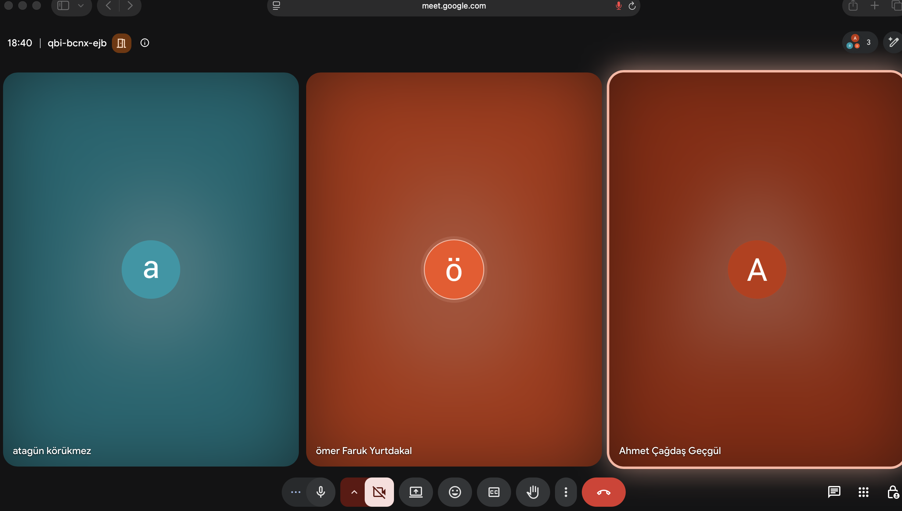
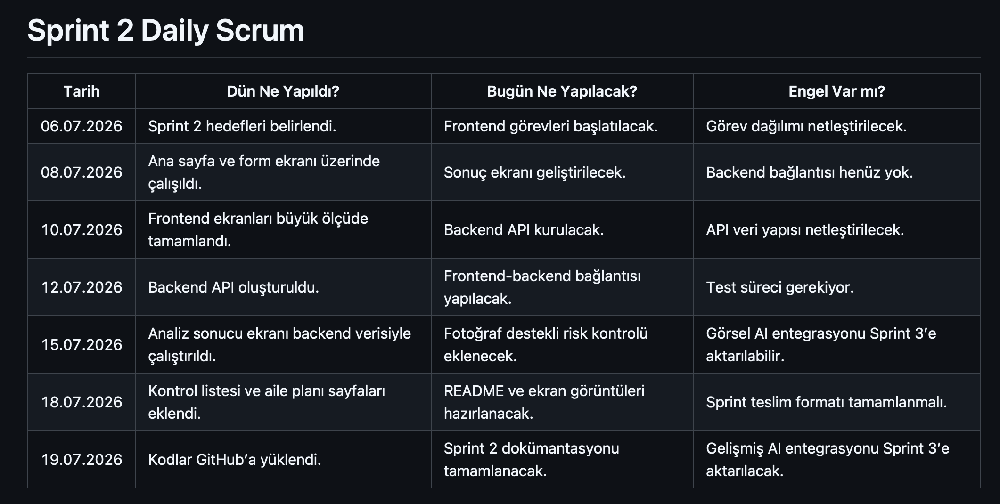
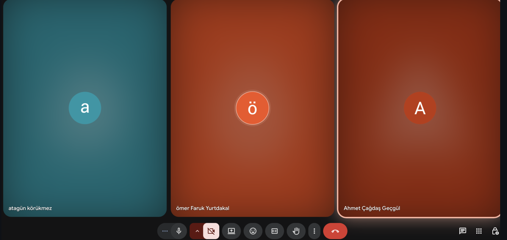
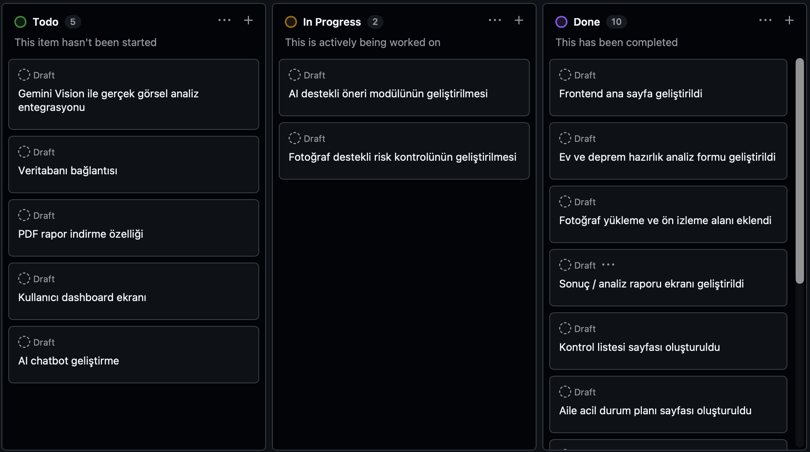
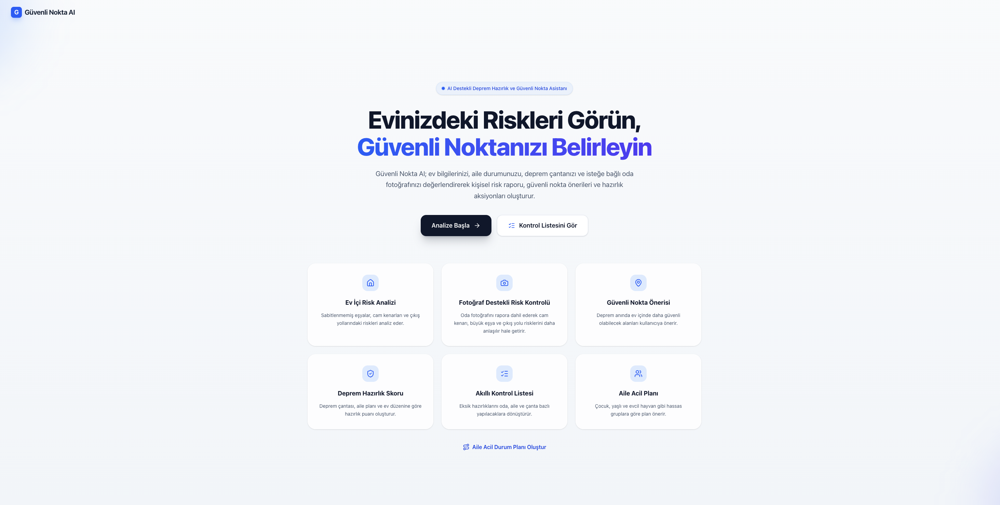
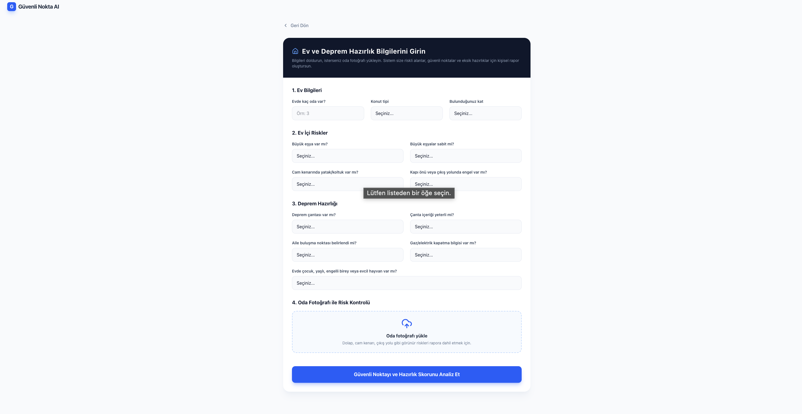
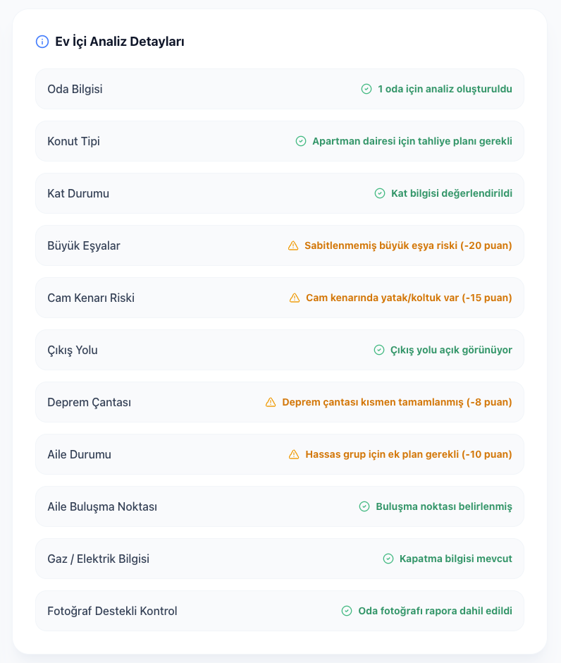
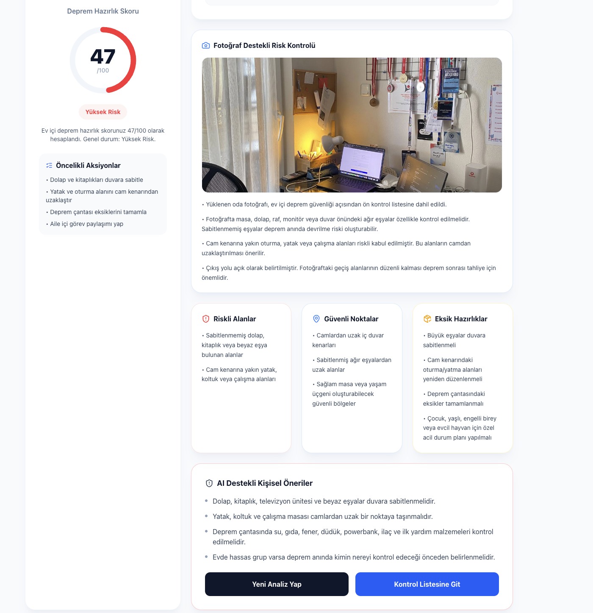
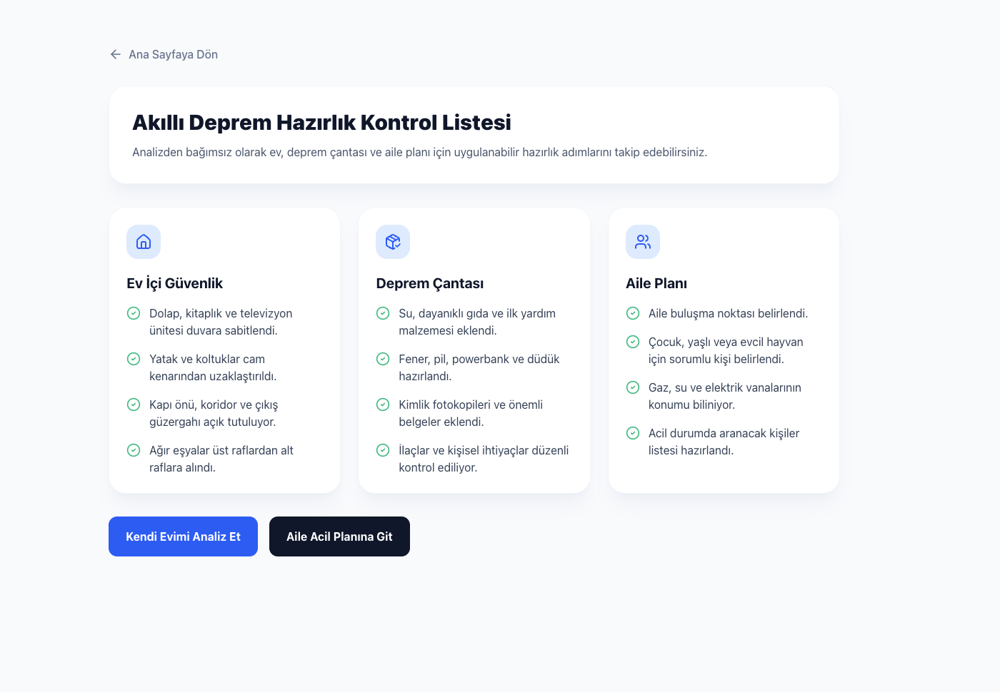
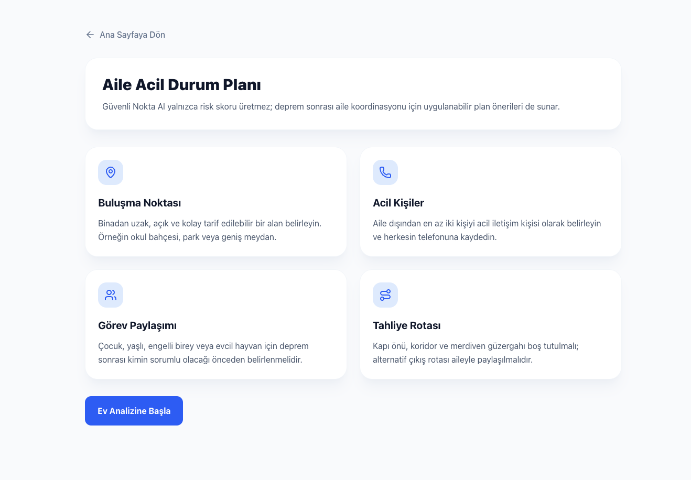

# Güvenli Nokta AI

Güvenli Nokta AI, kullanıcıların ev içi deprem risklerini analiz etmelerine ve deprem öncesi hazırlık seviyelerini artırmalarına yardımcı olan yapay zeka destekli bir hazırlık asistanıdır.

---

## Repository Link

GitHub Repository: https://github.com/cgdsgcgll/guvenli-nokta-ai

---

## Takım İsmi

**QuakeGuard Team**

---

## Takım Üyeleri ve Rolleri

| İsim | Rol |
|---|---|
| Ahmet Çağdaş Geçgül | Scrum Master |
| Atagün Körükmez | Product Owner |
| Ömer Faruk Yurtdakal | Developer |
| Nesibe Şeyma Can | Developer |
| Berat Karagöl | Developer |

---

## Ürün İsmi

**Güvenli Nokta AI**

---

## Ürün Açıklaması

Güvenli Nokta AI, kullanıcıdan alınan ev ve aile bilgilerine göre ev içi deprem risklerini analiz eden, güvenli nokta önerileri sunan ve kişisel deprem hazırlık puanı oluşturan yapay zeka destekli bir web uygulamasıdır.

Kullanıcı; oda sayısı, büyük eşyalar, cam kenarları, çıkış noktaları, aile yapısı ve deprem çantası durumu gibi bilgileri sisteme girer. Sistem bu bilgilere göre riskli alanları belirler, daha güvenli noktalar önerir, alınması gereken önlemleri listeler ve kullanıcıya kişisel bir deprem hazırlık puanı sunar.

---

## Problem

Deprem riski yüksek bölgelerde yaşayan birçok kişi, ev içerisindeki riskli alanları, sabitlenmesi gereken eşyaları ve deprem öncesi hazırlık seviyesini tam olarak bilmemektedir.

Ayrıca deprem çantası, aile buluşma noktası, acil durum planı ve ev içi güvenli alan seçimi gibi konular çoğu zaman eksik kalmaktadır. Bu durum deprem anında can güvenliği açısından ciddi riskler oluşturabilir.

---

## Çözüm

Güvenli Nokta AI, kullanıcının verdiği bilgilere göre kişiselleştirilmiş deprem hazırlık analizi yapar.

Sistem kullanıcıya:

- Ev içi risk analizi
- Güvenli nokta önerileri
- Deprem çantası eksik analizi
- Hazırlık puanı
- AI destekli kişisel öneriler
- Aile acil durum planı önerileri
- Fotoğraf destekli risk kontrolü
- Akıllı deprem hazırlık kontrol listesi

sunmayı hedefler.

---

## Hedef Kitle

- Evinde deprem hazırlığı yapmak isteyen bireyler
- Aileler
- Öğrenciler
- Yaşlı, çocuk veya evcil hayvan bulunan haneler
- Deprem riski yüksek bölgelerde yaşayan kullanıcılar
- Deprem bilincini artırmak isteyen kişiler

---

## Ürün Özellikleri

- Ev içi deprem risk analizi
- Güvenli nokta önerisi
- Deprem çantası eksik analizi
- Hazırlık puanı hesaplama
- AI destekli kişisel öneri sistemi
- Fotoğraf destekli risk kontrolü
- Akıllı deprem hazırlık kontrol listesi
- Aile acil durum planı önerisi
- Kullanıcı paneli
- Deprem hazırlık chatbotu

---

## Kullanılacak Teknolojiler

| Alan | Teknoloji |
|---|---|
| Frontend | React / TypeScript / Vite |
| Backend | Node.js / Express |
| Yapay Zeka | Gemini API veya benzer LLM API |
| Veritabanı | Firebase / MongoDB |
| Proje Yönetimi | GitHub Projects |
| Dokümantasyon | Markdown |

---

## Product Backlog

Product backlog dosyası:

[docs/product-backlog.md](docs/product-backlog.md)

### Product Backlog Görseli


---

# Sprint 1

## Sprint Notları

Sprint 1 sürecinde projenin temel fikri netleştirilmiş, takım üyeleri ve rolleri belirlenmiş, product backlog hazırlanmış, GitHub Projects üzerinde sprint board oluşturulmuş ve ürünün ilk arayüz taslakları çıkarılmıştır.

Bu sprintte temel amaç, doğrudan kod geliştirmeye başlamadan önce ürün fikrini, hedef kitleyi, proje yönetimi yapısını ve ilk kullanıcı akışını belirlemek olmuştur.

---

## Sprint İçinde Tamamlanması Hedeflenen Puan

Sprint 1 için hedeflenen toplam iş yükü **100 puan** olarak belirlenmiştir.

---

## Puan Tamamlama Mantığı

Sprint 1 puanlaması; proje fikrinin netleştirilmesi, takım rollerinin belirlenmesi, product backlog hazırlanması, sprint board oluşturulması, daily scrum notlarının tutulması, README düzenlemesi ve ilk arayüz taslaklarının hazırlanması üzerinden yapılmıştır.

| Görev | Puan |
|---|---:|
| Proje fikrinin netleştirilmesi | 15 |
| Takım rolleri ve ürün bilgilerinin belirlenmesi | 10 |
| Product backlog oluşturulması | 15 |
| Sprint board hazırlanması | 15 |
| Daily Scrum notlarının hazırlanması | 10 |
| README formatının düzenlenmesi | 15 |
| İlk arayüz taslaklarının hazırlanması | 20 |
| **Toplam** | **100** |

---

## Backlog Dağıtma Mantığı

Sprint 1 sürecinde öncelik, ürünün teknik geliştirmesinden önce proje fikrini ve proje yönetimi yapısını netleştirmek olarak belirlenmiştir.

Bu nedenle ilk sprintte şu işler önceliklendirilmiştir:

- GitHub repository oluşturma
- README dosyasını düzenleme
- Product backlog oluşturma
- Sprint board oluşturma
- Daily Scrum notları hazırlama
- İlk arayüz taslaklarını çıkarma
- Risk analizi mantığını planlama

Kod geliştirme, backend API kurulumu, AI entegrasyonu ve dashboard geliştirmesi gibi teknik işler Sprint 2’ye bırakılmıştır.

---

## Daily Scrum

Daily Scrum notları takımın ilerleyişini takip etmek için hazırlanmıştır.

| Tarih | Dün Ne Yapıldı? | Bugün Ne Yapılacak? | Engel Var mı? |
|---|---|---|---|
| 01.07.2026 | Proje fikri üzerine konuşuldu. | Deprem odaklı ürün fikri netleştirilecek. | Takım rolleri net değil. |
| 02.07.2026 | Güvenli Nokta AI fikri belirlendi. | GitHub reposu oluşturulacak. | Teknoloji seçimi net değil. |
| 03.07.2026 | GitHub reposu oluşturuldu. | README ve product backlog hazırlanacak. | Görev paylaşımı yapılmalı. |
| 04.07.2026 | README ve docs yapısı hazırlandı. | Sprint board ve görseller eklenecek. | Wireframe tasarımları tamamlanmalı. |
| 05.07.2026 | Sprint board ve ilk dokümanlar eklendi. | Sprint review ve retrospective yazılacak. | Sprint 2 görev dağılımı netleşmeli. |

### Sprint 1 Daily Scrum Ekran Görüntüsü


### Sprint 1 Daily Scrum Toplantı Ekran Görüntüsü



---

## Sprint Board Updates

Sprint 1 görevleri GitHub Projects üzerinde **Todo**, **In Progress** ve **Done** sütunlarıyla takip edilmiştir.

### Todo

- AI öneri sistemi araştırması
- Backend API yapısının kurulması
- Kullanıcı dashboard ekranı
- Risk puanı algoritmasının tasarlanması
- AI chatbot yapısının araştırılması

### In Progress

- README düzenleme
- Sprint 1 dokümantasyonu
- Wireframe tasarımları

### Done

- GitHub reposu oluşturuldu
- Product backlog hazırlandı
- Proje fikri belirlendi
- Daily Scrum notları eklendi
- Docs klasörü oluşturuldu
- İlk arayüz taslakları hazırlandı

### Sprint 1 Board Görseli


---

## Ürün Durumu

Sprint 1 sonunda ürünün temel fikri, hedef kitlesi, problem tanımı, çözüm yaklaşımı ve temel özellikleri belirlenmiştir.

Kod geliştirme aşamasına geçmeden önce ürünün ilk ekran taslakları hazırlanmıştır. Sprint 2 itibarıyla frontend, backend ve yapay zeka entegrasyonu tarafında geliştirme sürecine başlanması planlanmaktadır.

### Ana Sayfa Wireframe


### Form Sayfası Wireframe


### Sonuç Sayfası Wireframe


---

## Sprint Review

Sprint 1 sonunda aşağıdaki çıktılar tamamlanmıştır:

- GitHub repository oluşturuldu.
- Takım üyeleri ve rolleri belirlendi.
- Ürün fikri **Güvenli Nokta AI** olarak netleştirildi.
- Product backlog oluşturuldu.
- GitHub Projects üzerinde sprint board hazırlandı.
- Daily Scrum notları hazırlandı.
- Ana sayfa, ev bilgileri formu ve risk analizi sonuç ekranı için wireframe tasarımları oluşturuldu.
- README dosyası sprint formatına göre düzenlendi.

Sprint 1 sonunda ürün henüz kod geliştirme aşamasında değildir. Ancak proje geliştirme sürecine başlanabilmesi için gerekli planlama, backlog ve arayüz taslakları hazırlanmıştır.

---

## Sprint Retrospective

### İyi Gidenler

- Proje fikri kısa sürede netleştirildi.
- Takım rolleri belirlendi.
- GitHub repository oluşturuldu.
- Product backlog hazırlandı.
- Sprint board oluşturuldu.
- İlk arayüz taslakları hazırlandı.
- README sprint formatına uygun hale getirildi.

### Geliştirilmesi Gerekenler

- Takım içi görev dağılımı daha net yapılmalı.
- Her ekip üyesinin düzenli commit atması sağlanmalı.
- Daily Scrum notları daha düzenli tutulmalı.
- Sprint 2’de geliştirme süreci hızlandırılmalı.

### Sprint 2 İçin Aksiyonlar

- Frontend ekranlarının React ile kodlanmasına başlanacak.
- Backend API yapısı kurulacak.
- Risk puanı algoritması geliştirilecek.
- AI öneri sistemi için ilk prototip hazırlanacak.
- Kullanıcı verilerinin veritabanına kaydedilmesi planlanacak.
- Dashboard ekranı geliştirilecek.
- AI chatbot yapısı araştırılacak.

---

# Sprint 2

## Sprint Notları

Sprint 2 kapsamında, Sprint 1’de planlanan Güvenli Nokta AI fikri çalışan bir MVP prototipine dönüştürülmeye başlanmıştır. Bu sprintte temel hedef, kullanıcıdan ev ve deprem hazırlık bilgilerini alan, bu verileri backend tarafında analiz eden ve sonuç ekranında kişisel deprem hazırlık skoru ile öneriler sunan bir yapı oluşturmaktır.

Sprint 2 sonunda frontend arayüzleri geliştirilmiş, backend API oluşturulmuş ve frontend-backend bağlantısı tamamlanmıştır. Kullanıcının girdiği bilgilere göre riskli alanlar, güvenli noktalar, eksik hazırlıklar, öncelikli aksiyonlar ve kişisel öneriler sonuç ekranında gösterilmektedir.

Ayrıca ürünün pazara daha uygun görünmesi için fotoğraf destekli risk kontrolü, akıllı deprem hazırlık kontrol listesi ve aile acil durum planı sayfaları eklenmiştir.

---

## Sprint İçinde Tamamlanması Hedeflenen Puan

Sprint 2 için tamamlanması hedeflenen iş yükü: **100 puan**

---

## Puan Tamamlama Mantığı

| Görev | Puan |
|---|---:|
| Frontend ana sayfa geliştirmesi | 10 |
| Analiz formu geliştirmesi | 15 |
| Sonuç ekranı geliştirmesi | 15 |
| Backend API kurulumu | 15 |
| Frontend-backend bağlantısı | 15 |
| Risk / hazırlık skoru algoritması | 10 |
| Fotoğraf destekli risk kontrolü | 10 |
| Kontrol listesi ve aile planı sayfaları | 10 |
| **Toplam** | **100** |

---

## Backlog Dağıtma Mantığı

Sprint 2’de öncelik, ürünün temel MVP yapısını ortaya çıkarmak olarak belirlenmiştir. Bu nedenle ilk olarak frontend ekranları, ardından backend API ve frontend-backend bağlantısı geliştirilmiştir.

Sprint 2’de ürünün kullanıcıya değer sunan temel akışı oluşturulmuştur:

1. Kullanıcı ev ve deprem hazırlık bilgilerini girer.
2. Sistem bu bilgileri backend tarafında analiz eder.
3. Kullanıcıya deprem hazırlık skoru, riskli alanlar, güvenli noktalar ve kişisel öneriler sunulur.

Gelişmiş görsel yapay zeka entegrasyonu, veritabanı bağlantısı ve PDF rapor indirme gibi ileri özellikler Sprint 3’e aktarılmıştır.

---

## Daily Scrum

Sprint 2 sürecinde takım içi ilerleme Daily Scrum notları ile takip edilmiştir. Yapılan işler, yapılacak işler ve karşılaşılan engeller düzenli olarak değerlendirilmiştir.

| Tarih | Dün Ne Yapıldı? | Bugün Ne Yapılacak? | Engel Var mı? |
|---|---|---|---|
| 06.07.2026 | Sprint 2 hedefleri belirlendi. | Frontend görevleri başlatılacak. | Görev dağılımı netleştirilecek. |
| 08.07.2026 | Ana sayfa ve form ekranı üzerinde çalışıldı. | Sonuç ekranı geliştirilecek. | Backend bağlantısı henüz yok. |
| 10.07.2026 | Frontend ekranları büyük ölçüde tamamlandı. | Backend API kurulacak. | API veri yapısı netleştirilecek. |
| 12.07.2026 | Backend API oluşturuldu. | Frontend-backend bağlantısı yapılacak. | Test süreci gerekiyor. |
| 15.07.2026 | Analiz sonucu ekranı backend verisiyle çalıştırıldı. | Fotoğraf destekli risk kontrolü eklenecek. | Görsel AI entegrasyonu Sprint 3’e aktarılabilir. |
| 18.07.2026 | Kontrol listesi ve aile planı sayfaları eklendi. | README ve ekran görüntüleri hazırlanacak. | Sprint teslim formatı tamamlanmalı. |
| 19.07.2026 | Kodlar GitHub’a yüklendi. | Sprint 2 dokümantasyonu tamamlanacak. | Gelişmiş AI entegrasyonu Sprint 3’e aktarılacak. |

### Sprint 2 Daily Scrum Notları



### Sprint 2 Daily Scrum Toplantı Görseli



---

## Sprint Board Updates

Sprint 2 görevleri GitHub Projects üzerinde **Todo**, **In Progress** ve **Done** sütunlarıyla takip edilmiştir.

### Done

- Frontend ana sayfa geliştirildi.
- Ev ve deprem hazırlık analiz formu geliştirildi.
- Fotoğraf yükleme ve ön izleme alanı eklendi.
- Sonuç / analiz raporu ekranı geliştirildi.
- Kontrol listesi sayfası oluşturuldu.
- Aile acil durum planı sayfası oluşturuldu.
- Express backend API oluşturuldu.
- `/api/health` endpoint’i oluşturuldu.
- `/api/analyze` endpoint’i oluşturuldu.
- Frontend-backend bağlantısı yapıldı.
- Risk ve hazırlık skoru hesaplama mantığı eklendi.
- Sprint 2 kodları GitHub’a yüklendi.
- README Sprint 2 dokümantasyonu güncellendi.
- Sprint 2 ürün ekran görüntüleri eklendi.

### In Progress

- AI destekli öneri modülünün geliştirilmesi
- Fotoğraf destekli risk kontrolünün geliştirilmesi

### Sprint 3’e Aktarılanlar

- Gemini Vision ile gerçek görsel analiz entegrasyonu
- Veritabanı bağlantısı
- PDF rapor indirme özelliği
- Kullanıcı dashboard ekranı
- AI chatbot geliştirme

### Sprint 2 Board Görseli



---

## Ürün Durumu

Sprint 2 sonunda Güvenli Nokta AI için çalışan bir MVP prototipi oluşturulmuştur. Kullanıcı uygulama üzerinden ev bilgilerini, deprem hazırlık durumunu ve aile yapısını girebilmektedir. Sistem bu bilgileri backend tarafında analiz ederek kişisel deprem hazırlık skoru üretmektedir.

Sonuç ekranında kullanıcıya:

- Deprem hazırlık skoru
- Riskli alanlar
- Güvenli nokta önerileri
- Eksik hazırlıklar
- Öncelikli aksiyonlar
- Fotoğraf destekli risk kontrolü
- AI destekli kişisel öneriler

sunulmaktadır.

### Ana Sayfa



### Analiz Formu



### Sonuç Ekranı



### Fotoğraf Destekli Risk Kontrolü



### Kontrol Listesi



### Aile Acil Durum Planı



---

## Sprint Review

Sprint 2 sonunda ürünün temel MVP akışı başarıyla oluşturulmuştur. Kullanıcıdan alınan bilgiler backend API’ye gönderilmekte, backend tarafında analiz edilmekte ve sonuç ekranında kullanıcıya kişisel bir deprem hazırlık raporu sunulmaktadır.

Bu sprintte frontend ve backend bağlantısı tamamlanmış, analiz formu genişletilmiş, sonuç ekranı daha kapsamlı hale getirilmiş ve ürünün pazar değerini artırmak için kontrol listesi ile aile acil durum planı sayfaları eklenmiştir.

Fotoğraf destekli risk kontrolü özelliği temel seviyede eklenmiştir. Gerçek görsel yapay zeka entegrasyonu ise daha kapsamlı geliştirme gerektirdiği için Sprint 3’e aktarılmıştır.

---

## Sprint Retrospective

### İyi Gidenler

- Frontend ekranları başarılı şekilde geliştirildi.
- Backend API kurulumu tamamlandı.
- Frontend-backend bağlantısı yapıldı.
- Kullanıcıdan alınan verilere göre skor üreten bir sistem oluşturuldu.
- Sonuç ekranı kullanıcıya daha anlaşılır ve uygulanabilir öneriler sunacak şekilde geliştirildi.
- Ürün, kontrol listesi ve aile planı gibi ek özelliklerle daha kullanışlı hale getirildi.
- Sprint 2 ürün görselleri README dosyasına eklendi.
- Daily Scrum ve Sprint Board görselleri dokümantasyona dahil edildi.

### Geliştirilmesi Gerekenler

- Takım içi görev sürekliliği daha iyi takip edilmeli.
- AI ve görsel analiz tarafındaki görevler daha erken başlatılmalı.
- Commit dağılımı takım üyeleri arasında daha dengeli hale getirilmeli.
- Test ve hata ayıklama için daha fazla zaman ayrılmalı.
- Gerçek görsel yapay zeka entegrasyonu için teknik araştırma Sprint 3’te derinleştirilmeli.

### Sprint 3 İçin Aksiyonlar

- Gemini Vision veya benzer bir servis ile gerçek görsel analiz entegrasyonu yapılacak.
- Kullanıcı verilerinin veritabanına kaydedilmesi sağlanacak.
- PDF rapor indirme özelliği geliştirilecek.
- Kullanıcı dashboard ekranı oluşturulacak.
- AI chatbot / hazırlık asistanı geliştirilecek.
- UI/UX iyileştirmeleri yapılacak.

---

# Proje Klasör Yapısı

```text
guvenli-nokta-ai/
│
├── README.md
│
├── docs/
│   └── product-backlog.md
│
├── assets/
│   └── screenshots/
│       ├── product-backlog.png
│       ├── sprint-board.png
│       ├── daily-scrum.png
│       ├── daily-scrum-meeting.png
│       ├── wireframe-home.png
│       ├── wireframe-form.png
│       ├── wireframe-result.png
│       ├── sprint-2-home-page.png
│       ├── sprint-2-form-page.png
│       ├── sprint-2-result-page.png
│       ├── sprint-2-photo-risk-control.png
│       ├── sprint-2-checklist.png
│       ├── sprint-2-emergency-plan.png
│       ├── sprint2-board.png
│       ├── daily2-scrum.png
│       └── daily-scrum-meeting2.png
│
├── frontend/
├── backend/
└── ai/
